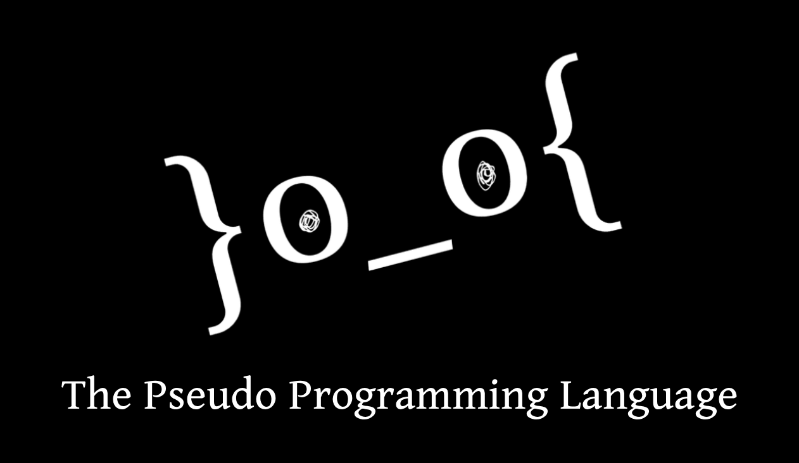

<h1 align="center">The Pseudo Programming Language</h1>

<p align="center">
  
</p>

<p align="center">
  <em>“a language for competitive programming that knows its purpose.”</em>
</p>

<p align="center">
  <a href="https://github.com/koljaPl/pseudo-programming-language/actions/workflows/ci.yml"></a>
  
  
  <a href="LICENSE"></a>
</p>

<p align="center">
  <a href="#implementation-status">Current status</a>
  · <a href="docs/grammar.ebnf">Grammar</a>
  · <a href="docs/goals_and_versions/version_0.01/goals.md">Version goals</a>
  · <a href="#quick-start">Quick start</a>
  · <a href="#tests">Tests</a>
</p>

TPPL is a programming language built specifically for competitive programming. Its compact syntax feeds a real compiler frontend and semantic pipeline, then lowers to C++20 so contest code stays focused on the problem rather than boilerplate.

## Implementation status

TPPL is a working but deliberately small alpha. It can compile a useful typed subset end to end, but it does not yet cover every kind of competitive-programming problem.

| Status | Current support |
| --- | --- |
| **Available end to end** | `int`, `bool`, `char`, `string`, recursive `vector<T>`, top-level functions and recursion, initialized locals, expressions and assignments, `if`/`else`, `while`, ranges, for-each, checked indexing, and runtime I/O |
| **Frontend only** | Globals, nested functions, and uninitialized locals are parsed and semantically checked, but the C++ backend deliberately rejects them |
| **Not implemented** | Structs, records or classes; enums or sum types; fixed-size arrays; maps and sets; and a broader standard algorithm library |

`vector<T>` is currently TPPL's only composite container, and user-defined data types are not available yet. The [Version 0.01 goals](docs/goals_and_versions/version_0.01/goals.md) describe the target design, not a guarantee that every item is already supported end to end.

## A contest-shaped language

```tpp
int square(int x) {
    return x * x;
}

int main() {
    vector<int> answers = vector<int>(5, 0);

    for i in 0..5 {
        answers[i] = square(i + 1);
    }

    for answer in answers {
        print(answer);
    }

    return 0;
}
```

## Why TPPL?

- **Contest-first.** Every design choice starts from the constraints of competitive programming.
- **C++20-backed.** Keep the familiar contest toolchain while writing less ceremony.
- **Compiler-built.** Syntax, names, types, and control flow are checked before code generation.

## Compiler pipeline

```text
.tpp → Lexer → Parser → Declaration Collection → Name Resolution
     → Type Checking → Control-Flow Checking → Lowering → C++20 → g++ → executable
```

## Quick start

Build from source with CMake and a C++20 toolchain:

```bash
cmake -S . -B build -DCMAKE_BUILD_TYPE=Release
cmake --build build --parallel

./build/pseudo --emit-cpp solution.tpp > solution.cpp
g++ -std=c++20 -Iruntime/include solution.cpp -o solution
./solution
```

`pseudo --emit-cpp` writes C++ source. Invoking `g++` and running the resulting executable are separate steps in the current CLI.

## Tests

```bash
ctest --test-dir build --output-on-failure
```

<p align="center">
  <code>Debug</code> · <code>Release</code> · <code>ASan + UBSan</code> · <code>strict warnings</code> · <code>generated C++</code> · <code>g++ E2E</code>
</p>

The suite covers the frontend, semantic passes, lowering, code generation, runtime behavior, recovery, determinism, and toolchain integration.

## Community

TPPL is fully open source. Built by competitors, for competitors—contributions, experiments, and ideas are welcome.

Read the [contribution guide](CONTRIBUTING.md), follow the [Code of Conduct](CODE_OF_CONDUCT.md), and report vulnerabilities through the [security policy](SECURITY.md).

## Author

The Pseudo Programming Language was created by **Nicklas Plugin** before his 16th birthday.

<p align="center">
  <sub>Released under the <a href="LICENSE">MIT License</a>.</sub>
</p>
